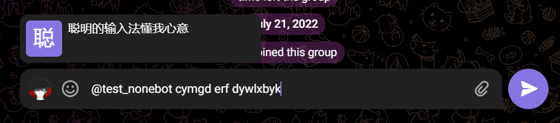

# Nonebot Plugin TelegRIME

基于 [NoneBot2](https://github.com/nonebot/nonebot2) 和 [RIME](https://rime.im/) 的 Telegram 输入法 Bot

图中输入方案为星空键道 6

## 安装

- Windows 上需要 64 位的 rime.dll（仓库里已经有一个编译好的）。
- Linux 上不可用，待开发。

## 使用

~~不会真有人想用这玩意吧？~~

将 rime 用户目录的 build 文件夹复制到机器人根目录。

## 鸣谢

灵感来源：[OverflowCat/telegrime](https://github.com/OverflowCat/telegrime)
